## **CAPSTONE PROJECT - 2026**

# Anti-Money Laundering Transaction Detection

Author:   Alona Drok

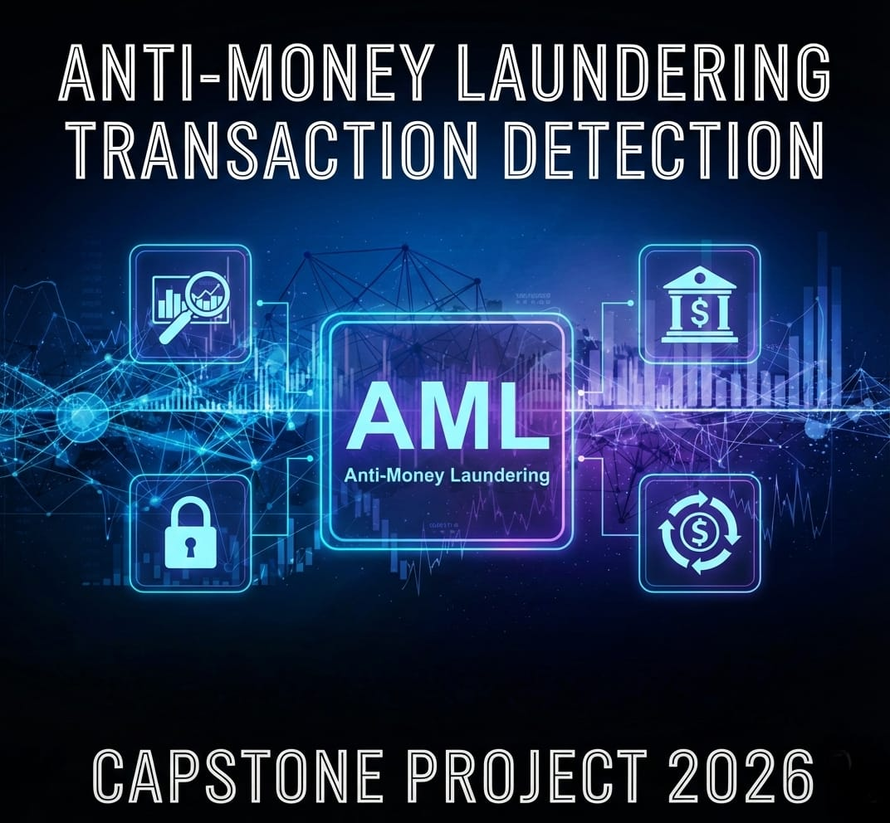

This project builds a data analytics with AI solution to detect high‑risk transactions and estimate customer risk using the **SAML‑D synthetic transaction monitoring dataset**. By learning from historical transaction behaviour, the project aims to help financial institutions minimise losses, strengthen AML controls. 

***

## Table of Contents

1. [Key Resources](#key_resources)  
2. [Project Presentation](#project-presentation)  
3. [Project Overview](#project-overview)  
4. [Dataset Content](#dataset-content)  
5. [Personas & Stakeholders](#personas--stakeholders)  
6. [Business Requirements](#business-requirements)  
7. [Hypotheses and Validation](#hypotheses-and-validation)  
8. [Project Plan](#project-plan)  
9. [Rationale for Visualisations](#rationale-for-visualisations)  
10. [Analysis Techniques Used](#analysis-techniques-used)  
11. [Ethical Considerations](#ethical-considerations)  
12. [Dashboard Design](#dashboard-design)  
13. [Unfixed Bugs](#unfixed-bugs)  
14. [Development Roadmap](#development-roadmap)  
15. [Deployment](#deployment)  
16. [Main Data Analysis Libraries](#main-data-analysis-libraries)  
17. [Credits](#credits)  

## Key Resources:

- **Dataset**: [https://www.kaggle.com/datasets/berkanoztas/synthetic-transaction-monitoring-dataset-aml](https://www.kaggle.com/datasets/berkanoztas/synthetic-transaction-monitoring-dataset-aml)
- **GitHub Repository**: [https://github.com/AlonaDrok/Capstone_project](https://github.com/AlonaDrok/Capstone_project)

## Project Presentation

For a comprehensive overview of the methodology, key findings, model performance, and business recommendations, see:

- **Project Presentation (PPT)** – `assets/presentation/capstone.pptx`  
- **Project Presentation (PDF)** – `assets/presentation/capstone.pdf`  

***

## Project Overview

This capstone project focuses on building a robust **Data Analytics with AI** solution to predict risk and detect fraud transaction patterns using synthetic banking data. 

- The solution analyses millions of transactions to identify **high‑risk behaviour** that may indicate potential fraud or financial crime. 
- The models generate **transaction‑level risk flags** and **customer‑level risk scores**, which can be consumed by risk, compliance, and branch teams. 
- The ultimate goal is to empower financial institutions with **data‑driven insights** to minimise financial losses and AML compliance. 

***

## Dataset Content

The project uses the **Anti Money Laundering Transaction Data (SAML‑D)** dataset created by Oztas et al. and published on Kaggle. 

Key characteristics: 
- ~9.5 million transactions with 12 features and 28 typologies (11 normal, 17 suspicious).  
- Only ~0.1039% of transactions are labelled as suspicious, making it a highly imbalanced classification problem.  

Main fields: 
- **Time and Date** – chronological ordering of transactions.  
- **Sender / Receiver Account IDs** – capture relationships and behavioural patterns.  
- **Amount** – value of the transaction.  
- **Payment Type** – credit card, debit card, cash, ACH, cross‑border, cheque.  
- **Sender / Receiver Bank Location** – includes high‑risk regions (e.g. Mexico, Turkey, Morocco, UAE).  
- **Payment Currency & Receiver Currency** – allow detection of currency mismatches.  
- **`is_suspicious`** – binary label for suspicious vs normal transactions.  
- **`type`** – typology class describing specific behavioural patterns.  

In this project, suspicious transaction patterns are also treated as **strong indicators of customer risk score**, and aggregated to **customer risk level features** 

***

## Personas & Stakeholders

Three primary personas guide design and evaluation (names and roles aligned with your user stories). 

- **Ann Patel – Compliance Officer**  
  - Reviews alerts from AML and risk systems, validates suspicious cases, and prepares regulatory reports.  
  - Needs transparent risk scores, clear explanations and audit‑ready case summaries. 

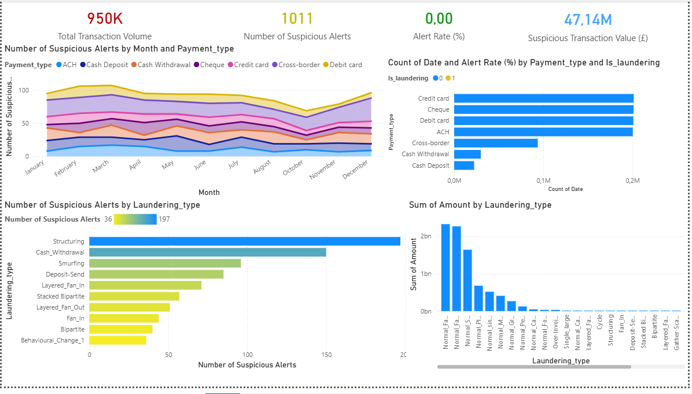

This Power BI dashboard, designed for Compliance Officer  Ann Patel, provides a high-level overview of Anti-Money Laundering (AML) metrics and suspicious transaction patterns.
The dashboard is organized into four main sections, focusing on key indicators, payment type analysis, laundering typology distribution, and amount distribution.

Key Metrics: Displays 950K transactions, 1011 suspicious alerts, and £47.14M in suspicious value.
Trends & Payment Types: Tracks suspicious alerts monthly and analyzes which payment methods (Credit card, ACH, etc.) are most frequent.
Laundering Typologies: Identifies Structuring as the most common alert type with 197 alerts.
Amount Distribution: Highlights that "Normal Fan-In" patterns account for the highest total transaction amounts (around 2bn). 

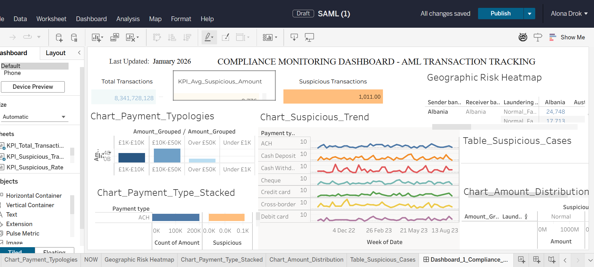

The dashboard provides a high-level overview of transaction monitoring, highlighting a massive total transaction volume but a relatively small number of suspicious alerts (1,011). Visuals track these suspicious trends over time across different payment methods and identify high-volume amount groups and geographic risks in regions like Albania.

Visualizations and Charts
Chart_Payment_Typologies (Bar Chart): Shows the distribution of Amount grouped into bins: £1K-£10K, £10K-£50K, Over £50K, and Under £1K. The £10K-£50K bin has the largest volume (around 4B).
Chart_Payment_Type_Stacked (Stacked Bar Chart): Compares the Count of Amount (Normal vs. Suspicious) for the Payment type ACH. The suspicious count is much smaller.
Chart_Suspicious_Trend (Line Chart): A multi-line chart showing the week-over-week trends for different Payment_type (ACH, Cash Deposit, Cash Withd., Cheque, Credit card, Cross-border, Debit card) from December 2022 to August 2023.
Geographic Risk Heatmap (Table/Map fragment): Shows Sender_bank_location and Receiver_bank_location 

- **Michel Johnson – Data Analyst**  
  - Builds and maintains credit‑risk models and supports decision engines.  
  - Needs clean, documented features, comparison of model performance and explainable outputs.  

- **Sarah Khan – Branch Manager**  
  - Oversees lending decisions and branch performance.  
  - Needs simple dashboards with risk segments, key KPIs and customer‑level summaries to support decisions.  

These personas drive the **business questions**, **visual designs**, and **explainability requirements** of the solution. 

***

## Business Requirements

The core business goal is to **reduce financial losses and managing compliance risk** by identifying high‑risk customers and transactions early. 

Key questions:  
- Which **transaction patterns** and **customer behaviours** are most associated with suspicious or default‑like risk?  
- Can we **predict transaction‑level suspicion** and **customer‑level risk scores** with sufficient accuracy and interpretability?  
- How can risk and branch teams **consume these insights** through dashboards and reports to improve decisions?  

Business requirements:  
- Provide **transaction‑level risk flags** with explanations (drivers, typology indicators).  
- Provide **customer‑level risk scoring** (e.g. low / medium / high) based on aggregated behaviour.  
- Support **interactive dashboards** for:  
  - transaction monitoring (suspicious volume, typologies, regions).  
  - Risk insights (high‑risk customers).  
  - Branch‑level monitoring for managers like Sarah.  

***

## Hypotheses and Validation

The analysis is guided by several hypotheses:

1. **Hypothesis 1: Certain transaction patterns strongly correlate with suspicious / high‑risk behaviour.**  
   - *Examples:* frequent cross‑border payments, high amounts, use of high‑risk corridors, or sudden spikes in card usage. 
   - **Validation:** descriptive statistics, correlation analysis, stratified EDA, and feature importance from ML models.  

2. **Hypothesis 2: Customers with persistent suspicious‑like behaviour exhibit higher risk score.**  
   - **Validation:** aggregate transaction features at customer level (frequency, total amount, suspicious ratio, region mix), then compare risk scores against labels (where available) and proxy default risk metrics.  

3. **Hypothesis 3: Machine learning models can effectively detect suspicious transactions despite heavy class imbalance.**  
   - **Validation:** train multiple classifiers and cost‑sensitive metrics. 

***

## Project Plan

The project follows a structured data‑analytics pipeline similar to other credit‑risk capstones. 

1. **ETL & Data Management**  
   - Load raw SAML‑D data from Kaggle.  
   - Clean and validate schema, handle missing or inconsistent values, and store processed CSV.  

2. **Exploratory Data Analysis (EDA)**  
   - Examine distributions of amount, payment type, regions, and currencies.  
   - Explore typology types and network patterns at a high level.  

3. **Feature Engineering**  
   - Transaction‑level features: normalised amount, time features, currency mismatch flags, corridor indicators.  
   - Customer‑level aggregates: counts, sums, average amounts, suspicious ratio, diversity of counterparties and regions.  
 

4. **Evaluation & Explainability**  
   - Compute standard classification metrics and confusion matrices.  
   - Use feature importance and SHAP‑style techniques (where applicable) for local & global explanations.

5. **Dashboarding & Reporting**  
   - Build dashboards (e.g. Tableau / Power BI / Streamlit) for Ann aligned with business requirements.  
   - Document key insights and recommendations in the final report and presentation.  

***

## Rationale for Visualisations

To answer stakeholder questions effectively, each dashboard uses specific visual types, inspired by prior risk score capstones. 

- **Executive Overview**  
  - KPIs: suspicious rate, number of high‑risk customers, volume by corridor.  
  - Bar charts: transactions by payment type and region.  

- **Risk Drivers & Typologies**  
  - Stacked bar / heatmaps: suspicious share by payment type, region, and typology.  
  - Boxplots: distribution of amounts for suspicious vs non‑suspicious transactions.  

- **Customer‑Level Risk**  
  - Histograms and density plots: distribution of risk scores.  
  - Segment charts: counts of customers by risk band (low / medium / high).  

- **Model Performance**  
  - Confusion matrices and metric tables 
  - Feature importance charts and partial‑dependence / plots.  

This mapping ensures both technical and non‑technical users can understand **what** is happening and **why** the models made specific predictions. 

***

## Analysis Techniques Used

The project combines traditional analytics with AI / ML approaches, similar to other risk prediction work. 

- **Data Preparation & EDA**  
  - `pandas`, `numpy` for data manipulation.  
  - Descriptive statistics, correlation matrices, and visual EDA (`seaborn`, `matplotlib`).  

ETL

` 01_etl_transaction_risk.ipynb `

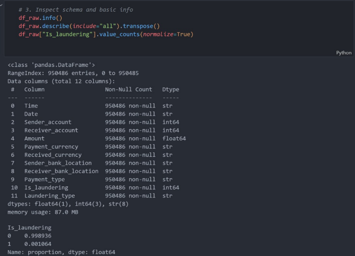
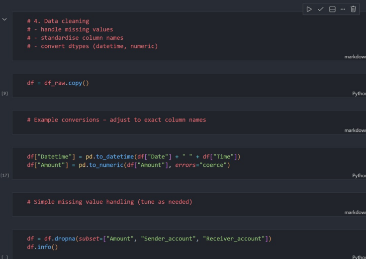

EDA

` 02_eda_exploration.ipynb `

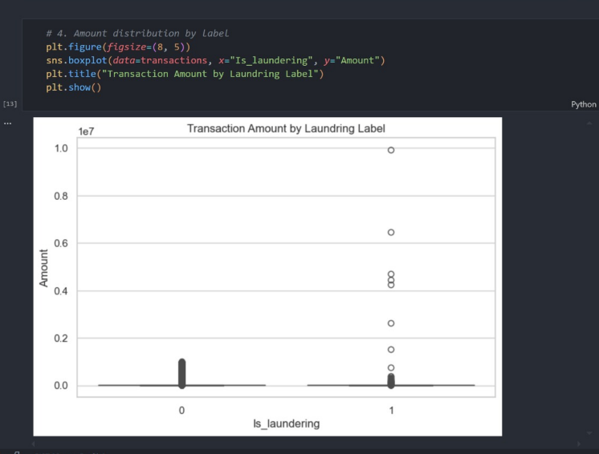
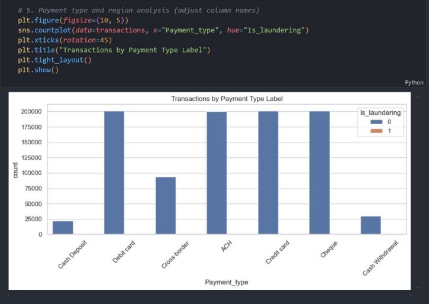
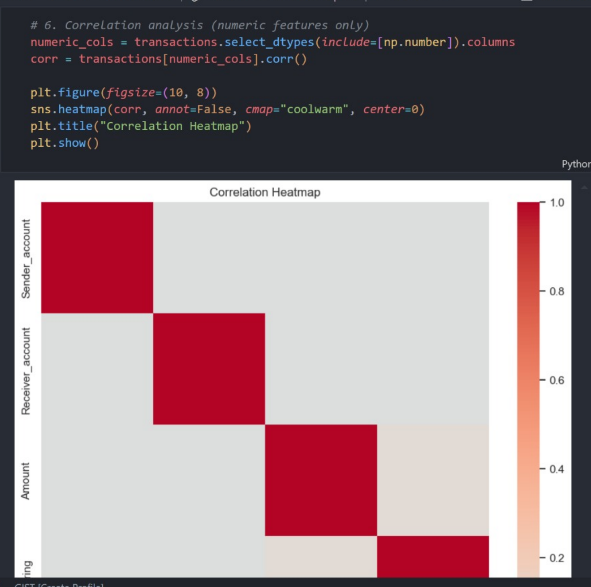

- **Feature Engineering**  
  - Creation of behaviour‑based features (frequency, intensity, volatility).  
  - Encoding of categorical fields (payment type, region, typology).  

` 03_statistical_analysis.ipynb`

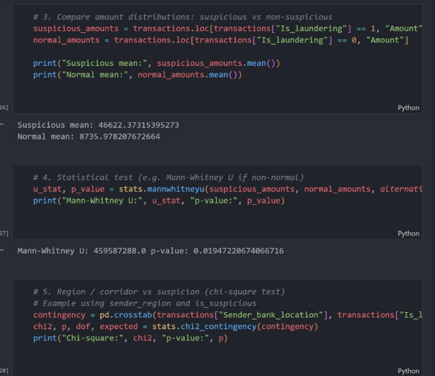
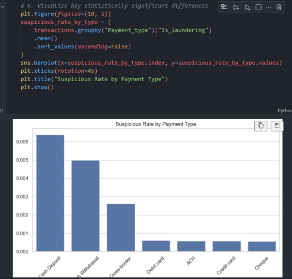

- **Machine Learning**  
  - Supervised classification for high‑risk flag.  
  - Algorithms: Logistic Regression, Decision Tree, Random Forest, Gradient Boosting. 
  - Techniques for class imbalance: class weights, SMOTE/undersampling.  

`04_machine_learning.ipynb`

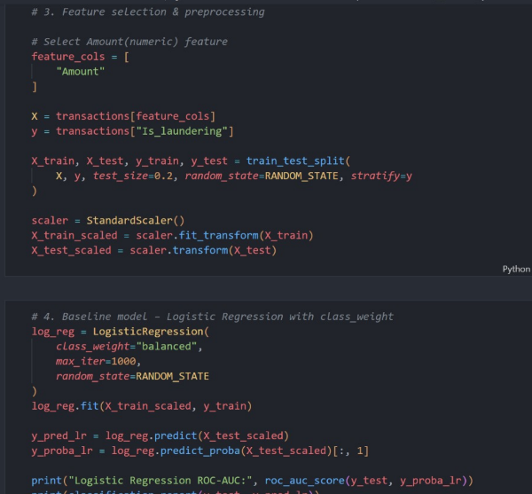
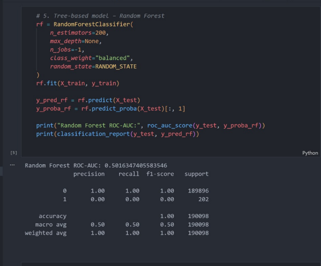
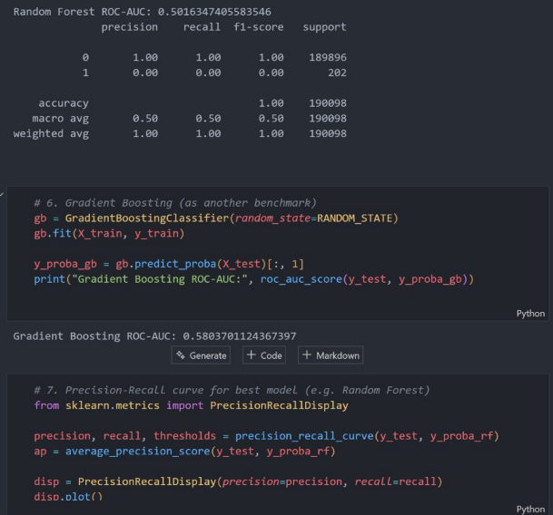
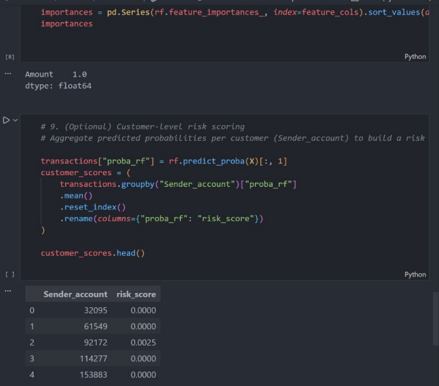

***

## Ethical Considerations

Because this project deals with **financial risk and potential financial crime**, several ethical aspects are considered. 

- **Bias & Fairness**  
  - Transaction and regional features can encode structural or geopolitical biases.  
  - The project focuses on behaviour‑based signals rather than protected attributes where possible.  

- **Privacy & Synthetic Data**  
  - SAML‑D is synthetic and does not contain real customer identities, reducing privacy risk.
  - In a real‑world deployment, strict data‑protection and access‑control policies would be mandatory.  

- **Responsible AI**  
  - Models are intended as **decision support**, not fully autonomous decision makers.  
  - Explainability and human‑in‑the‑loop review are emphasised for high‑impact decisions (e.g. blocking transactions).  

***

## Dashboard Design

The dashboards are designed to support distinct user journeys for Ann, Michel, and Sarah. 

- **Compliance View (Ann)**  
  - Suspicious transaction trends over time.  
  - Top typologies, corridors, and high‑risk customers.  
  - Case drill‑downs with transaction lists and feature‑level drivers.  

- **Risk Modelling View (Michel)**  
  - Model comparison tables and metrics.  
  - Feature importance charts and diagnostic plots.  
  - Data quality checks and feature distributions.  

- **Branch View (Sarah)**  
  - Branch‑level risk KPIs and risk‑band distribution.  
  - Lists of high‑risk customers for proactive outreach.  
  - Simple, interpretable indicators and tooltips.  

***
## Unfixed Bugs

- **GitHub large file limit:** Full dataset `SAML-D.csv` tracked with GitHud but cannot be previewed in GitHub.
Updated dataset for future analysis `SAML-D_reduced.csv` 
- **Tableau KPI formatting:** Titles and percentage alignment required multiple adjustments; some minor misalignment may still occur.
- **Title truncation in Tableau:** Longer titles can be cut off in published view on smaller screens.

## Development Roadmap

Planned and potential enhancements:

- Add **network‑analysis features** using the account graph structures provided in SAML‑D. 
- Experiment with **graph neural networks** or advanced anomaly‑detection methods for typology detection.  
- Implement **auto‑retraining and monitoring** (drift detection, performance tracking).  

***
## Deployment

The deployment process is carried out using Tableau.
('Dashboard _AML_Transaction_Detection.twbx')
The deployment process is carried out using Power BI
('Dashboard_Ann_Patel.pbix')

## Main Data Analysis Libraries

The Python analysis heavily relied on the following libraries:

- **`pandas`**: For data manipulation and analysis.
- **`numpy`**: For numerical operations.
- **`scikit-learn`**: For machine learning model training, evaluation, and preprocessing.
- **`matplotlib`**: For static data visualization.
- **`seaborn`**: For enhanced statistical data visualization.

***

## Credits

- **Dataset:** Anti Money Laundering Transaction Data (SAML‑D) by B. Oztas et al. on Kaggle. 
Link: https://www.kaggle.com/datasets/berkanoztas/synthetic-transaction-monitoring-dataset-aml
- **Research Reference:** B. Oztas, D. Cetinkaya, F. Adedoyin, M. Budka, H. Dogan and G. Aksu, "Enhancing Anti-Money Laundering: Development of a Synthetic Transaction Monitoring Dataset," 2023 IEEE International Conference on e-Business Engineering (ICEBE), Sydney, Australia, 2023, pp. 47-54, doi: 10.1109/ICEBE59045.2023.00028.
https://ieeexplore.ieee.org/document/10356193
- **Learning Platform & Mentors:** course, mentors, and supporters.  

