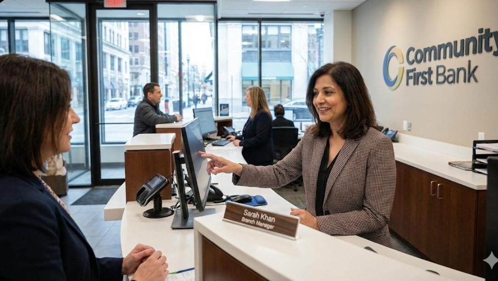

### **Persona 3** – *Sarah Khan, Branch Manager*

Sarah is a 43‑year‑old Branch Manager of a busy city‑centre branch, responsible for sales targets, local lending decisions and customer satisfaction. She is organised, highly customer‑focused and comfortable with simple dashboards, but not a technical expert in analytics.
​

🧭 Story & context: Sarah oversees relationship managers and loan officers who originate personal and small‑business credit, while monitoring portfolio performance and delinquency trends.
​

✅ Needs & goals:

View branch‑level customers by risk segment based on the predictive model.

Support loan and limit‑increase decisions with an interpretable risk indicator.

Track high‑risk approvals and their performance over time.